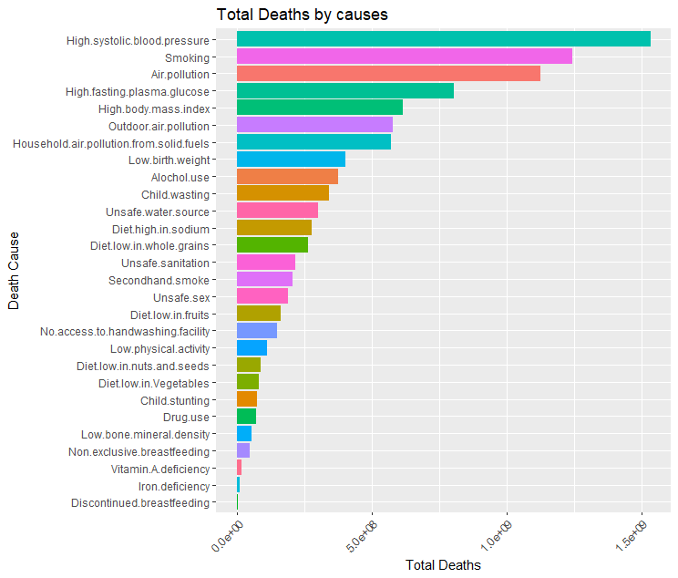
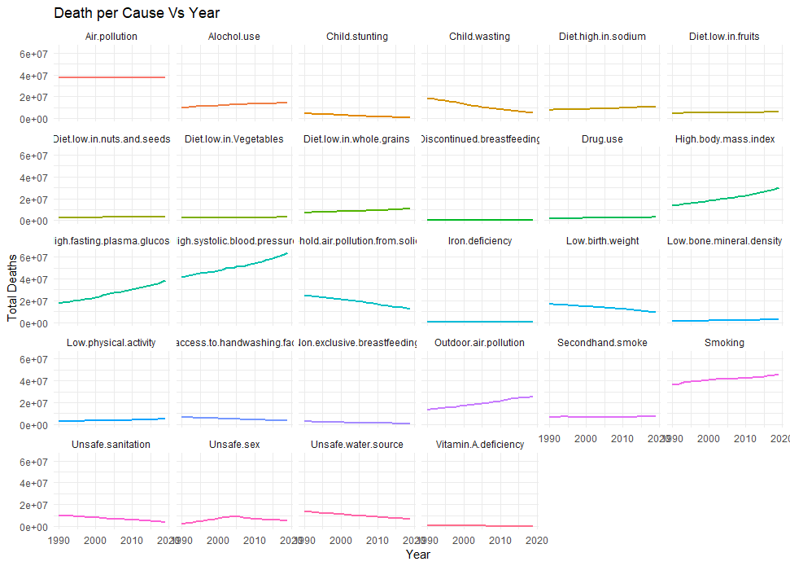
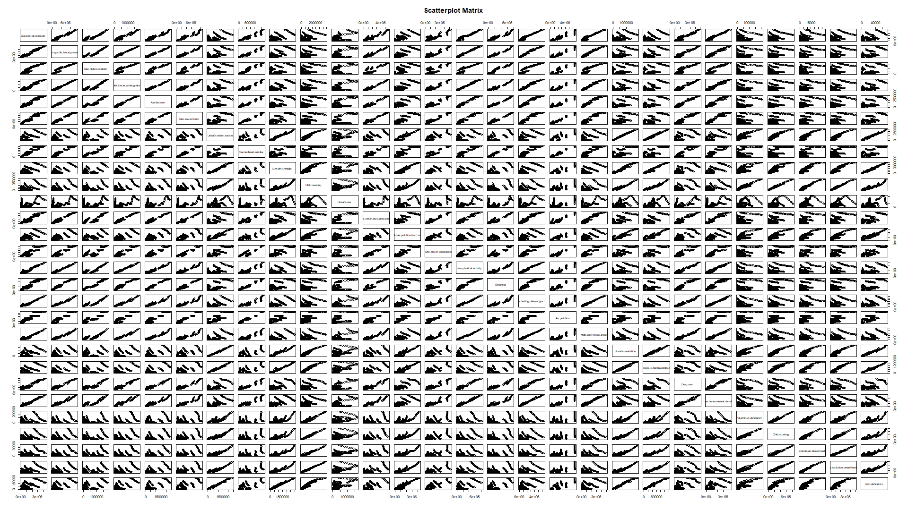
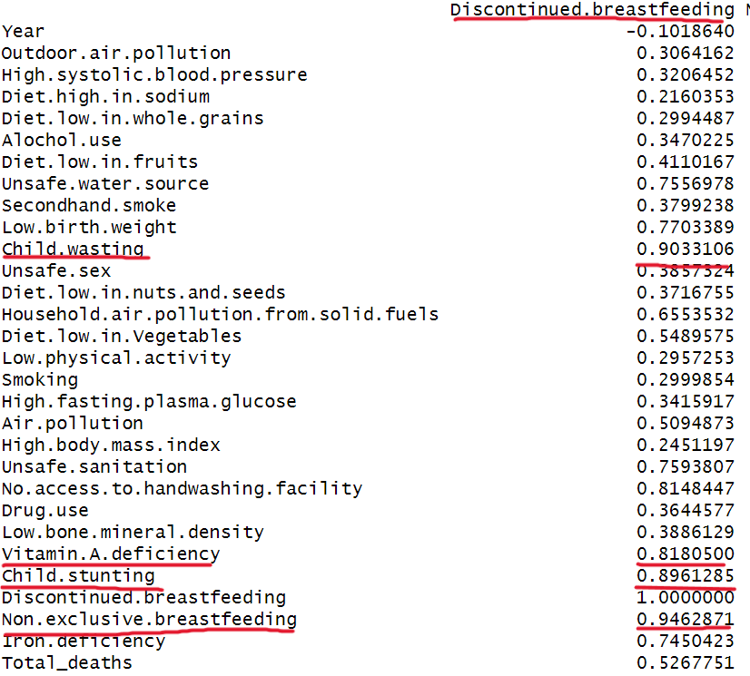
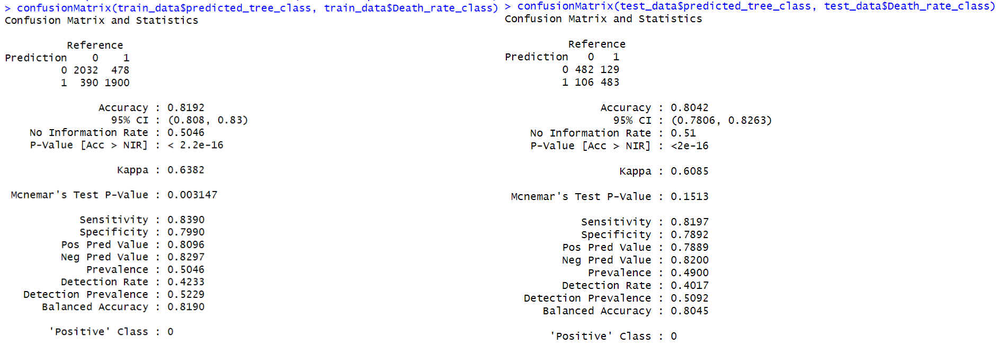
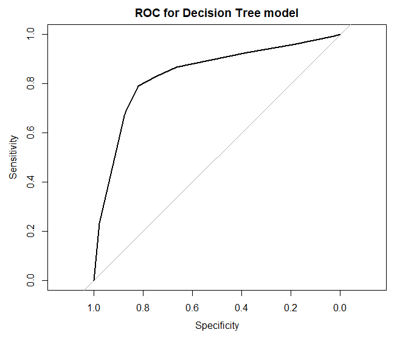
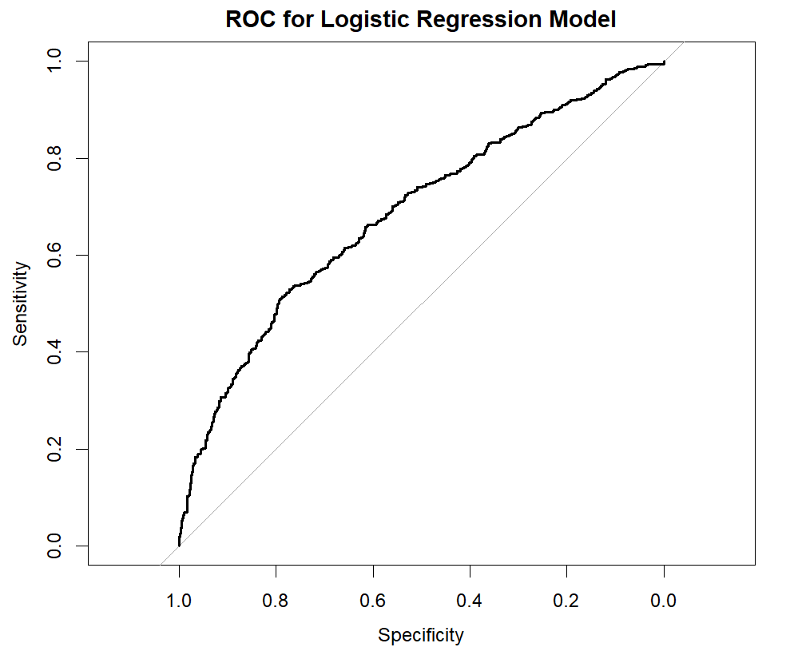
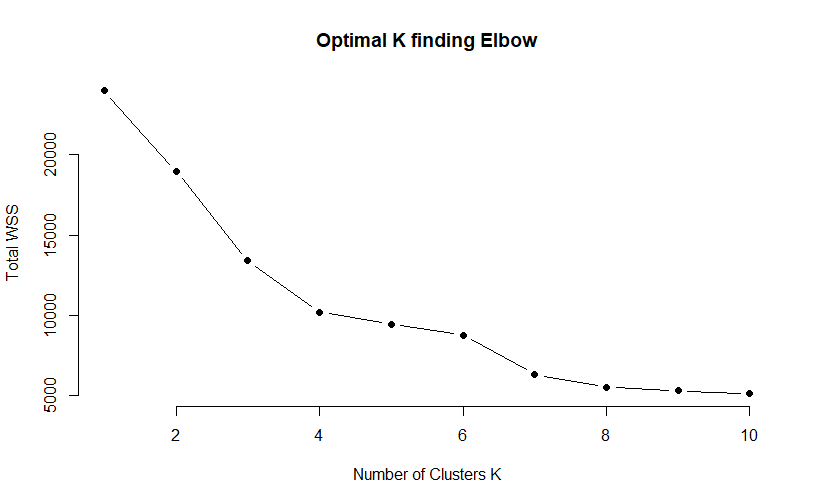
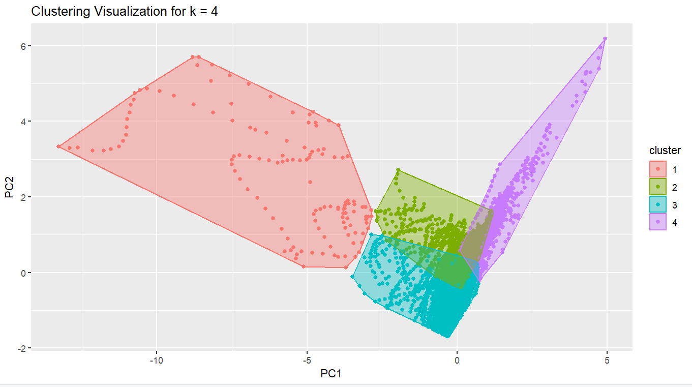
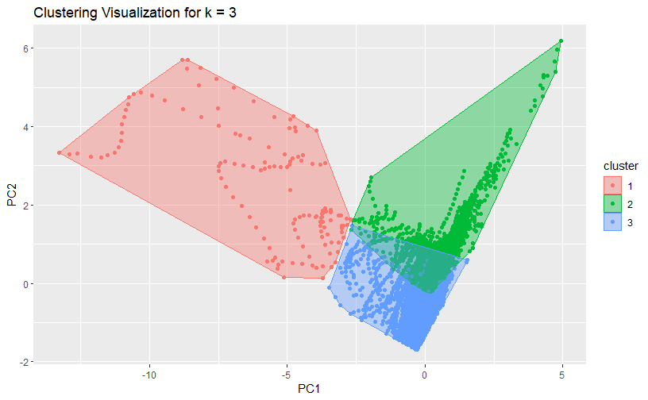

```{r, message=FALSE, warning=FALSE, echo=FALSE}
library(ggplot2)
library(knitr)
library(gridExtra)
```

# Introduction
In this project, we will analyze a dataset from the World Health Organization (WHO), combined with population and GDP per capita data from the World Bank. The aim is to explore the factors contributing to high or low death rates in different countries. By leveraging various health and environmental variables, we develop predictive models to analyze these death rates. Additionally, we implement a clustering demonstration to reveal how countries are grouped based on the selected features.

Additional codes were also created for project analysis outside the Shiny app, they were provided in project.R in the zip file for reference, along with the datasets we used. 

> Shiny App Demonstraion: "https://www.youtube.com/watch?v=slSngJBQzzU"

\vspace{0.5cm}

# Data Exploration
As the first step in our project, we begin by taking a closer look at the dataset. By examining its structure and summary, we can gain a better understanding of the data and the variables it contains.

From the `str(df)` function, we observe that the dataset consists of 6,840 rows and 31 variables. Each row represents death causes in a specific country for a particular year, while the columns capture a wide range of health and environmental factors contributing to death rates. Some key columns include:

- **Entity**: The name of the country (character type).
- **Code**: The three-letter country code (character type).
- **Year**: The year of data collection, which ranges from 1990 to 2019 for each country.

The remaining columns represent various causes of death, all of which are integers. This indicates that the values in these columns reflect the total number of deaths attributable to each specific cause.

The `summary(df)` function provides insights into the range of values for each death cause, including the minimum, 1st quartile, median, mean, 3rd quartile, and maximum:

- Some columns, the minimum values are either 0 or very small. This could indicate missing data or that certain countries or regions (e.g., sparsely populated places like American Samoa) experience few or no deaths related to particular causes.
- Conversely, the maximum values in some columns are in the millions, likely due to high population densities in countries like China and India.
- There is a notable difference between the median and mean values in many columns. For example, while the median death count can be in the hundreds, the mean can be in the hundreds of thousands. This large discrepancy signals that the data is heavily **right-skewed**, meaning that a few countries experience disproportionately high numbers of deaths from specific causes, while most other countries have relatively low numbers.

The `head(df)` function shows us the first few rows of the dataset. If we use `head(df, 30)`, we can examine the data for Afghanistan from 1990 to 2019, and it allows us to track how different causes of death evolve over the years in different country. For instance:

- **Outdoor Air Pollution**: There is a gradual increase in deaths from air pollution until around 2010, after which the rise becomes much more pronounced. This may reflect growing industrialization or environmental degradation during this period.

- **Vitamin A Deficiency**: This cause of death shows a drastic increase between 1995 and 2003, possibly linked to political instability or the impacts of conflict, but it gradually decreases in subsequent years. This could be a result of improved public health interventions or changes in nutritional policies.

# Data Visualization
In this experiment, we aim to analyze global health data by visualizing the distribution and relationships between various causes of death, as well as their trends over time. I have decided to do the following visualizations:

### Histogram (Barchart)
We would like to examine the overall distribution of death counts for each variable across all countries and years, so we can identify leading contributing of death cases per cause and gain a general overview of how common or rare certain health-related deaths are globally.

> From the histogram, it's evident that High Systolic Blood Pressure, Smoking, and Air Pollution are the leading causes of death. In contrast, deaths related to Vitamin A Deficiency, Iron Deficiency, and Discontinued Breastfeeding occur far less frequently, indicating that these factors contribute minimally to overall mortality.



### Line Plot
We would like to explore the yearly trend of each health-related variable across the dataset, aggregated for all countries, this helps us to detect overall patterns and changes in death counts over time, and identify whether specific health risks are increasing, decreasing, or staying relatively stable across the years.

> Upon closer inspection, we observe that certain factors, such as High Systolic Blood Pressure and High Fasting Plasma Glucose, have been increasing rapidly over the years. While Smoking and Outdoor Air Pollution contribute significantly to mortality, their growth is not as fast. Some factors, like Air Pollution and Diet Low in Fruits, show relatively stable trends over time. Additionally, we see a decline in causes such as Child Wasting and Low Birth Weight. What's more, we notice a shifting trend in Unsafe Sex, which peaked around 2005 and has been gradually declining since.



### Pair Plot (Scatter-plot Matrix)
We would like To explore the potential relationships and correlations between multiple health-related variables. The pair plot (scatter-plot matrix) allows us to examine pairwise relationships between two specific variables, and find correlated variables with shared health factors.

> Upon closer examination, we observe strong positive and linear relationships in some child-related pairs, such as Child stunting vs. Child wasting. Certain variables like Air Pollution and Secondhand Smoke, exhibit similar patterns across all observations but do not show strong correlations with other variables. Additionally, some pairs, such as Outdoor Air Pollution vs. No Access to Handwashing Facilities, display a weak negative and not-well connected correlation, often accompanied by large clusters of outliers.



# Data Modeling
In this section, we combine the WHO dataset on causes of death with the World Bank's population and GDP per capita data. By normalizing total deaths against population, we can calculate the death rate for each country by year. Our objective is to predict whether a country has a high or low death rate based on multiple factors.  In addition to economic factors, we include some important health conditions, especially on child support and sex control, significantly impact death tolls. We would also like to consider the continent a country belongs to, as it may represent social or cultural factors affecting death rates. For classification purposes, any death rate above the global average is classified as high, and anything below as low.

## Single variate model
Based on later correlation analysis, we witness that GDP per capita has the highest correlation with Death rate class, being 0.1927740. This suggests that a country's economic status, represented by GDP per capita, plays a significant role in determining whether it experiences a high or low death rate, which serves as a good single variate model as a baseline for comparison.

## Null model
A null model is a model that's independent from the different inputs, in this case, no matter what inputs (e.g. GDP per capita and other variables) is given, null model would always predict the 50/50 chances on death rate class.

## Data Cleaning and Transformation
The WHO dataset contains rows for each country and year, while the World Bank datasets (population and GDP per capita) store years as columns. Thus to align these datasets, we need to truncate the data to match our target years (1990–2019), handle missing values, and merge the datasets to build a final dataset for model training.

1. **Data Overview**
The datasets from World Bank present information below:
Population: contains the total population per country for each year.
GDP per Capita: contains GDP per capita (in current US$) for each country and year.

2. **Truncate the Datasets to Match Relevant Years**
Our death cause dataset contains data from 1990 to 2019. To ensure consistency across datasets, we truncated the population and GDP per capita datasets to only include these years. The columns for years before 1990 and after 2019 were excluded from the analysis.

3. **Summarize Death Cause Data by Country and Year**
Next, we summarized the death cause dataset by aggregating the total number of deaths per country for each year. This involved summing all the death causes for each country-year combination.

4. **Reshape the Population and GDP Datasets**
After truncating the population and GDP datasets to the relevant years, we need to transform it and match to the Death cause dataset by country code and also the year, allowed us to align the population and GDP values.
In the Population Dataset, The columns for years (X1990, X1991, etc.) were reshaped into a single Year column, with corresponding Population values, Similarly, the GDP columns (X1990, X1991, etc.) were reshaped into a Year column, with corresponding GDP_per_capita values.
To create a complete dataset for modeling, we merged the death summary, population, and GDP per capita datasets. The merge was based on Country Code and Year, ensuring that each country-year combination had complete information on total deaths, population, and GDP per capita.

5. **Clean and handle missing data**
Upon reviewing the merged dataset, we discovered that some countries were either missing from the other datasets or lacked both population and GDP data for certain years. To resolve this, we used an inner join, which automatically excluded any country-year combinations with entirely missing data. For instances of partial missing data, we applied a down-up fill method to populate the missing values, ensuring that as much information as possible was retained in the dataset.

6. **Add new classifier**
To explore whether a country's continent influences its death rate, we created a dictionary mapping each country to its respective continent and added both a 'Continent' and 'Continent_class' column to our dataset. Additionally, given the high correlation between variables like "Child.wasting," "Child.stunting," "Non.exclusive.breastfeeding," "Discontinued.breastfeeding," and "Vitamin.A.deficiency," we introduced a new column, 'Child.related.death,' which aggregates the death tolls from these categories.

## Variable Combination Analysis
### Correlation
We first conducted a correlation analysis on all numerical variables, applying a filter to retain factors with an absolute correlation greater than 0.14. Ideally, we aim for multiple variables with neither too strong nor too weak correlations.

The results show a weak negative correlation between GDP_per_capita and Death_rate, as well as between Year and Death_rate. This suggests that countries with higher GDP per capita tend to have lower death rates, and more recent years are associated with lower death rates.

Other causes related to sexual health (Unsafe.sex) and child support also show weak correlations with Death_rate. None of these factors dominate the analysis, indicating that multiple explanatory variables influence the prediction. This suggests that a multivariate model, which incorporates several factors, is likely to outperform a single-variable model in explaining death rate patterns.

```
Death_rate_class              : 1.0000000
GDP_per_capita                : 0.1927740
Year                          : 0.1777312
Vitamin.A.deficiency           : 0.1759630
Unsafe.sex                    : 0.1717382
Non.exclusive.breastfeeding    : 0.1579129
Child.stunting                : 0.1507534
Child.wasting                 : 0.1490110
Discontinued.breastfeeding    : 0.1440670
```

We observed a strong correlation among child-support-related deaths (Child.wasting, Child.stunting, Non.exclusive.breastfeeding, Discontinued.breastfeeding, and Vitamin A deficiency). To simplify our model and reduce redundancy, we decided to create a new feature called Child.Related.Deaths, which represents the sum of these categories. See `6. Add new classifier` in Data Cleaning and Transformation.


### Information Gain Analysis
Next, we performed an Information Gain analysis to evaluate the significance of each variable in predicting death rates. This is where we included the Continent_class variable to explore potential social and cultural influences. From the analysis, we can observe the following importance values in the tree model structure:
```
                     Overall
Continent_class     808.1297
GDP_per_capita      729.7949
Unsafe.sex          524.0610
Child.related.death 422.3118
Year                194.5057
```

### PCA analysis
Next we would like to do PCA and further discover what combination of variables contribute to the importance of the model. Based on the PCA analysis, we can tell that the first principal component (PC1) captures 29.99% of the variation and is heavily influenced by variables in Child.related.death and Unsafe Sex.

Economic and social factors such as GDP_per_capita and Year are the second most important drivers, contributing 23.53%. Then we have Continent_class which influential in PC3, placing some cultural aspect to our model.

It's safe to say that all variables place fairly amount of importance and we decide to keep all in our modelling. In the training of our logistic regression model, We would also sequence our variables in the order of their priority based on their PC distribution, with PC1 being the most important. The variables are ordered as follows: `Child.related.death, Unsafe.sex, Year, GDP_per_capita, Continent_class`. 

```
Importance of components:
                          PC1    PC2    PC3    PC4    PC5
Standard deviation     1.2246 1.0846 1.0003 0.8672 0.7558
Proportion of Variance 0.2999 0.2353 0.2001 0.1504 0.1143
Cumulative Proportion  0.2999 0.5352 0.7353 0.8857 1.0000

                            PC1        PC2         PC3         PC4         PC5
GDP_per_capita       0.39438880  0.5583229  0.05767758  0.72202637  0.08991243
Year                 0.23274245  0.5799277 -0.54884533 -0.50225285 -0.23669753
Unsafe.sex          -0.60622249  0.2795052 -0.30414943  0.05494369  0.67738131
Child.related.death -0.64446063  0.2248944  0.01920151  0.26152855 -0.68214890
Continent_class      0.08633205 -0.4725026 -0.77625159  0.39370549 -0.10824734
```

### Training and testing
We split the merged dataset into a training set and a test set at a 80:20 ratio. The data is randomly sampled, allowing for an unbiased evaluation of the models' performance during testing. With over 6000 entries, it's safe to say that we have left enough data for both training and testing to assess its predictive accuracy.

### LIME analysis
From the LIME analysis, we can observe how different features and their conditions influence the model’s predictions locally. For instance, in the first test case, GDP_per_capita < 180 has a significant positive impact (0.339) on predicting a high death rate class (label 1), with a probability of 0.833. This shows that lower GDP per capita strongly correlates with a higher likelihood of falling into the high death rate category in this specific case.

#### LIME for Decision tree model

```
# A tibble: 60 x 13
   model_type  case  label label_prob model_r2 model_intercept model_prediction feature feature_value feature_weight feature_desc data        
   <chr>       <chr> <chr>      <dbl>    <dbl>           <dbl>            <dbl> <chr>           <dbl>          <dbl> <chr>        <list>      
 1 classifica~ 1     1          0.833    0.102           0.451           0.919  Contin~            1         0.0793  Continent_c~ <named list>
 2 classifica~ 1     1          0.833    0.102           0.451           0.919  GDP_pe~          180.        0.339   GDP_per_cap~ <named list>
 3 classifica~ 1     1          0.833    0.102           0.451           0.919  Unsafe~          378         0.0152  246 < Unsaf~ <named list>
 4 classifica~ 1     1          0.833    0.102           0.451           0.919  Child.~        36766         0.0289  33131 < Chi~ <named list>
 5 classifica~ 1     1          0.833    0.102           0.451           0.919  Year            1992         0.00542 Year <= 1993 <named list>
 6 classifica~ 1     0          0.167    0.102           0.549           0.0808 Contin~            1        -0.0793  Continent_c~ <named list>
 7 classifica~ 1     0          0.167    0.102           0.549           0.0808 GDP_pe~          180.       -0.339   GDP_per_cap~ <named list>
 8 classifica~ 1     0          0.167    0.102           0.549           0.0808 Unsafe~          378        -0.0152  246 < Unsaf~ <named list>
 9 classifica~ 1     0          0.167    0.102           0.549           0.0808 Child.~        36766        -0.0289  33131 < Chi~ <named list>
10 classifica~ 1     0          0.167    0.102           0.549           0.0808 Year            1992        -0.00542 Year <= 1993 <named list>
```

#### LIME for logistic regression model
In the logistic regression model, we observe a different decision-making process. For instance, in the first test case, Child.related.death > 36766 has a weight of 0.438. This highlights the importance of child-related deaths in influencing the logistic regression model's decision to classify a country as having a high death rate.

```
# A tibble: 50 x 13
   model_type     case  label label_prob model_r2 model_intercept model_prediction feature feature_value feature_weight feature_desc
   <chr>          <chr> <chr>      <dbl>    <dbl>           <dbl>            <dbl> <chr>           <dbl>          <dbl> <chr>       
 1 classification 1     high       0.717    0.410           0.474           1.06   Contin~            1          0.0282 Continent_c~
 2 classification 1     high       0.717    0.410           0.474           1.06   GDP_pe~          180.         0.0576 GDP_per_cap~
 3 classification 1     high       0.717    0.410           0.474           1.06   Unsafe~          378         -0.0432 246 < Unsaf~
 4 classification 1     high       0.717    0.410           0.474           1.06   Child.~        36766          0.438  33131 < Chi~
 5 classification 1     high       0.717    0.410           0.474           1.06   Year            1992          0.101  Year <= 1993
 6 classification 1     low        0.283    0.410           0.526          -0.0562 Contin~            1         -0.0282 Continent_c~
 7 classification 1     low        0.283    0.410           0.526          -0.0562 GDP_pe~          180.        -0.0576 GDP_per_cap~
 8 classification 1     low        0.283    0.410           0.526          -0.0562 Unsafe~          378          0.0432 246 < Unsaf~
 9 classification 1     low        0.283    0.410           0.526          -0.0562 Child.~        36766         -0.438  33131 < Chi~
10 classification 1     low        0.283    0.410           0.526          -0.0562 Year            1992         -0.101  Year <= 1993
```

### Machine learning analysis
#### Confusion matrix and ROC for Decision Tree model
From the confusion matrix, we observe that the decision tree model, when applied to the testing set, achieves an accuracy of 0.8042, a sensitivity (true positive rate) of 0.8197, and a specificity (true negative rate) of 0.7892. These results are fairly promising. Moreover, when comparing the results from the training set to the testing set, the output metrics—such as accuracy, kappa, sensitivity, and specificity—are quite similar. This indicates that the model is not overfitting, as the performance on the test set is nearly equivalent to that of the training set.


From the ROC plot, we can see that the curve arcs upward toward the upper-left corner, reaching a point around 0.9. This indicates that the model performs excellently, with a high true positive rate and low false positive rate.


#### Confusion matrix and ROC for Logistic Regression Model
We also observe similar outputs from both the training and testing datasets in our logistic regression model, indicating consistent generalization but with lower overall performance compared to the decision tree model. From the confusion matrix, the logistic regression model shows an accuracy of 0.6358, sensitivity (True Positive) of 0.6837, and specificity (True Negative) of 0.5899. 
This performance is notably weaker, especially when predicting low death rates. A possible explanation is that the linear nature of logistic regression struggles to treat Continent_class as numerical values might reduce the model's ability to effectively account for regional or cultural differences.


In the ROC plot, we observe the curve arcing toward the top-left, though not as sharply as the first model. This suggests a more moderate performance compared to the decision tree model.


# Data Clustering
- **Feature Selection**: Since our objective is to group countries based on similar profiles, including socioeconomic factors, risky health indicators, and childcare variables, while also tracking changes over time, we have selected the following set of variables for clustering: `GDP_per_capita, Child.related.death, Unsafe.sex, Year`
- **Distance Measure Selection**: We will use Euclidean distance as the distance measure for the K-means algorithm. It is the most commonly used distance measure for K-means and works effectively with continuous, numerical data, offering a straightforward calculation of distance between points in feature space.

### Find optimal k clusters
We will use the Elbow method to determine the optimal number of clusters by computing the total within-cluster sum of squares (WSS) with different values of k. From the resulting graph, we observed that the "elbow point" occurs around k=4, where adding additional clusters does not significantly reduce the within-cluster variance.



### Clustering Analysis
The clustering plot shows distinct separation between most clusters, with Cluster 1 (red) and Cluster 4 (purple) being clearly differentiated along the PC1 axis, suggesting that PC1 is a key factor in separating these groups. However, Clusters 2 (green) and 3 (blue) overlap, indicating similarities or less distinct boundaries in terms of the features driving the principal components for these clusters. Cluster 4's elongated shape suggests more variation within that group, while Cluster 1 spreads widely along PC1. 


To further investigate and compare the clustering results, we conducted an additional experiment with k=3. Although the WSS graph begins to smooth out at this point, it is not as optimal as when k=4. In the new cluster 2, the points are sparsely distributed in the top-left direction, indicating less precise clustering. Other patterns remain similar, with a clear distinction between cluster 1 and the rest. Cluster 2 seems to have absorbed most of the points that were part of clusters 2 and 4 in the previous k=4 setting, leading to less defined boundaries between groups.



